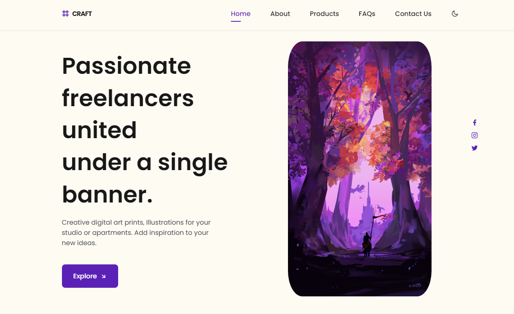

# Craft

A website that showcases  digital arts by group of artists . created using HTML, CSS, and JavaScript.

## Getting Started

These instructions will help you get a copy of the project up and running on your local machine for development and testing purposes.

1. Clone the repository to your local machine using the following command:

git clone https://github.com/adithpv/craft-landing-page.git

2. Open the `index.html` file in a web browser or use the [Live Server](https://marketplace.visualstudio.com/items?itemName=ritwickdey.LiveServer) extension if you are using Visual Studio Code to view the landing page.

## Usage

The landing page features a gallery of digital art pieces with descriptions and prices. Visitors can navigate the site and view the available art pieces.

## Screenshots

A screenshot of the Craft landing page, showcasing the gallery of digital art pieces available for sale.

## Contributing

If you'd like to contribute to the project, please follow these guidelines:

1. Create a fork of the repository.
2. Make the changes in your fork.
3. Create a pull request for your changes.

Please make sure to keep the code clean and well-commented, and to include a description of the changes you've made.

## License

This project is licensed under the [MIT License](https://opensource.org/licenses/MIT).

